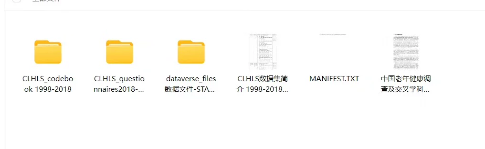
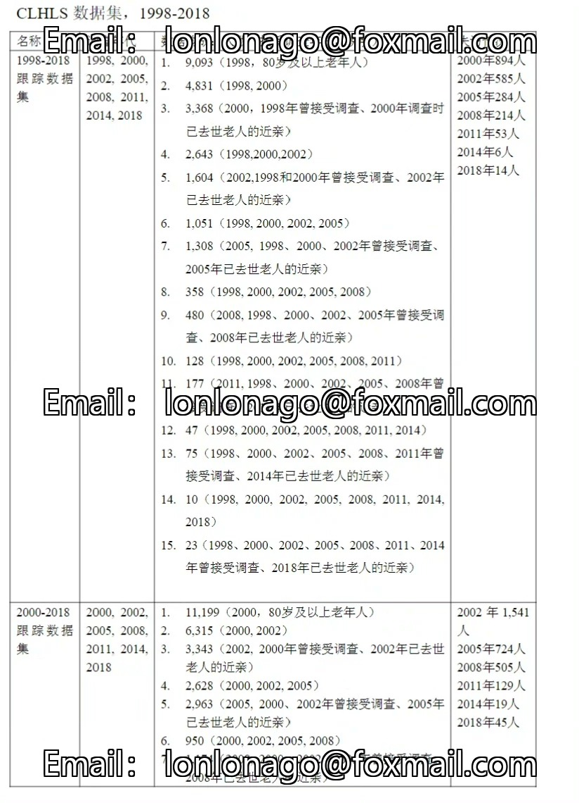

## Body

CLHLS China Elderly Health Status Survey: Tracking the Influencing Factors of Aging Health

Data Collection from 1998 to 2018
Format: STATA, SPSS, Excel data
Includes all corresponding questionnaires

Exclusive integration of high-reliability data for various analytical reports
Immediate shipment upon purchase, online 24 hours

PS: The fee charged by this store is only for consultancy services and labor costs for data organization. All data organized by this store are obtained through legal channels such as the internet. This resource is only for reading and exchange purposes.

## Images

Here is a pay link on Stripe ( https://buy.stripe.com/3cs8yP7sY87d0vu9AB ). Please contact me lonlonago@foxmail.com after funding $89, and I will send you a complete data files , thank you!

